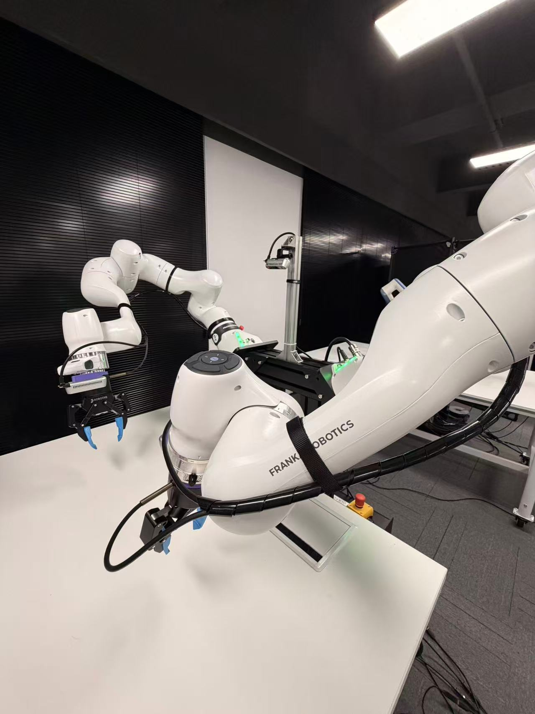
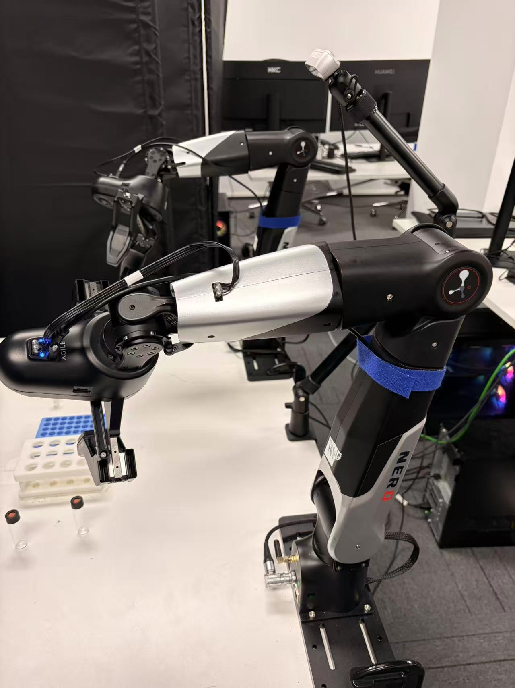
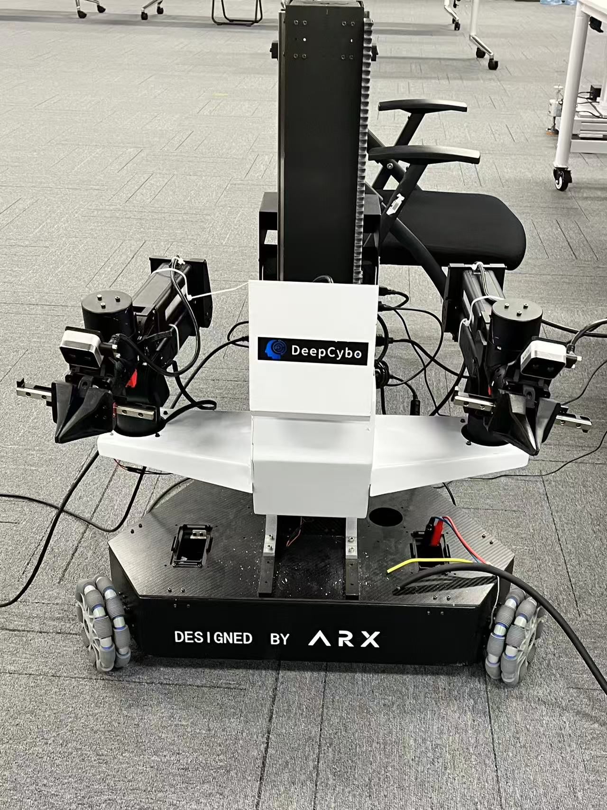
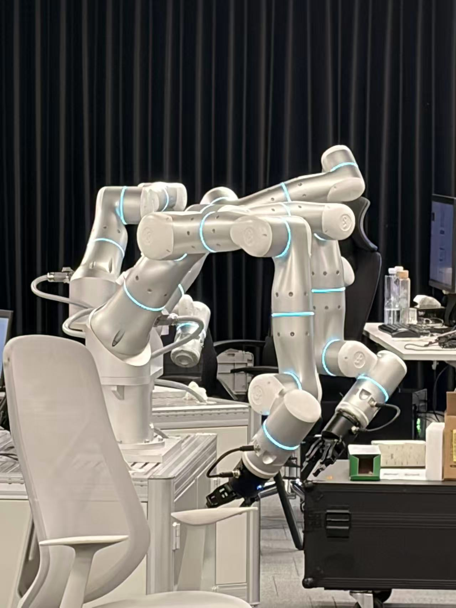

# Dual Arm Teleoperation, Data Collection and Policy Training

Dual Arm Teleoperation, Data Collection and Policy Training is a LeRobot-based toolkit for robot teleoperation, dataset collection, replay, visualization, preprocessing, and policy training. It is designed around dual-arm manipulation, but also keeps a single-arm Franka path for development and debugging.

Datasets collected with this repository are intended for training policies in [openpi-franka](https://github.com/Shenzhaolong1330/openpi-franka.git), StarVLA, and the local ACT / Diffusion Policy training pipeline provided here.

<p align="center">
  
  <br>
  <sub>Record teleoperation episodes directly into the LeRobot dataset format.</sub>
</p>

## Highlights

- **Multi-robot abstraction**: one recording/training workflow for Franka, Dobot, ARX R5, and AgileX Nero style systems.
- **Oculus Quest teleoperation**: 6-DoF controller tracking mapped to robot end-effector delta pose.
- **LeRobot datasets**: records synchronized images, robot state, Cartesian delta actions, and gripper commands.
- **OpenPI and StarVLA training data**: collected datasets can be used by [openpi-franka](https://github.com/Shenzhaolong1330/openpi-franka.git) and StarVLA training workflows.
- **Replay and visualization**: quickly inspect collected trajectories and send recorded actions back to hardware.
- **Policy training and deployment**: supports ACT and Diffusion Policy through LeRobot policy configs.
- **Dataset cleaning tools**: trim long static spans, smooth noisy Cartesian actions, and preserve gripper event context before ACT training.

## Supported Robots

Robot support is registered in [robots/__init__.py](robots/__init__.py). Select the active robot with `record.robot_type` in [scripts/config/record_cfg.yaml](scripts/config/record_cfg.yaml).

| `robot_type` | System | Typical Action Space | Notes |
| --- | --- | --- | --- |
| `franka_dual_arm` | Dual Franka + Robotiq | left/right delta EE pose + binary gripper | Current primary deployment path. |
| `dobot_dual_arm` | Dual Dobot Nova | left/right delta EE pose or joint action + gripper | Includes Dobot RPC client/server utilities. |
| `arx_dual_arm` | ARX R5 dual arm | left/right delta EE pose or joint action + integrated gripper | Includes ARX filtering, deadband, and URDF assets. |
| `nero_dual_arm` | AgileX Nero dual arm | left/right delta EE pose + gripper | Configured through `dual_agilx_nero`. |
| `franka` | Single Franka | right delta EE pose or joint action + gripper | Useful for single-arm tests and development. |
| `flexiv_dual_arm` | Flexiv dual arm | Coming soon | Flexiv support incoming. |

<p align="center">
  
  
  
  
  <br>
  <sub>Hardware snapshots: Dual Franka, Dobot, ARX R5, AgileX Nero, and upcoming Flexiv support.</sub>
</p>

Additional assets:

<p align="center">
  
  
  
  <br>
  <sub>Other robot assets and Oculus Quest 3S teleoperation device.</sub>
</p>

## Supported Operations

| Command | Purpose |
| --- | --- |
| `robot-record` | Record a dataset, run a trained policy, or mix policy and teleoperation depending on `record.run_mode`. |
| `robot-replay` | Replay an episode from a LeRobot dataset on the selected robot. |
| `robot-visualize` | Visualize dataset episodes and camera streams. |
| `robot-reset` | Reset or home the selected robot. |
| `robot-train` | Train ACT or Diffusion Policy using [scripts/config/train_cfg.yaml](scripts/config/train_cfg.yaml). |
| `robot-help` | Print the available command summary. |
| `tools-check-rs` | List connected RealSense camera serial numbers. |
| `tools-check-dataset` | Inspect and repair local dataset bookkeeping. |
| `tools-preprocess-dataset` | Generate a cleaned dataset for policy training. |
| `bash scripts/tools/check_robotiq_ports.sh` | Check Robotiq serial ports. |
| `bash scripts/tools/map_gripper.sh` | Helper script for gripper device mapping. |

Recording mode is controlled by:

```yaml
record:
  run_mode: "run_record"  # run_record, run_policy, or run_mix
  robot_type: "franka_dual_arm"
  control_mode: "oculus"
```

## Supported Algorithms

Policy configuration files live in [scripts/config/policies](scripts/config/policies).

| Algorithm | Config | Use Case |
| --- | --- | --- |
| ACT | [act_cfg.yaml](scripts/config/policies/act_cfg.yaml) | Action Chunking Transformer for vision/state conditioned imitation learning. |
| Diffusion Policy | [diffusion_cfg.yaml](scripts/config/policies/diffusion_cfg.yaml) | Diffusion-based action sequence generation. |
| OpenPI | [openpi-franka](https://github.com/Shenzhaolong1330/openpi-franka.git) | External OpenPI training pipeline for Franka policy learning from collected datasets. |
| StarVLA | [starVLA/starVLA](https://github.com/starVLA/starVLA) | External VLA training framework that can consume collected robot datasets. |

Training uses [scripts/config/train_cfg.yaml](scripts/config/train_cfg.yaml). The current training path also supports motion-biased sampling for datasets with many near-static frames:

```yaml
action_sampling:
  enabled: True
  min_translation_norm: 0.010
  min_rotation_norm: 0.030
  active_weight: 20.0
  inactive_weight: 0.2
```

## Dataset Preprocessing for ACT

The preprocessing tool is configured in [scripts/config/preprocess_dataset_cfg.yaml](scripts/config/preprocess_dataset_cfg.yaml). It writes a new dataset instead of modifying the original one.

Supported cleaning steps:

| Feature | Behavior |
| --- | --- |
| Static trimming | For continuous static spans longer than `min_static_frames`, keep only the first `keep_start_frames` and last `keep_end_frames`. |
| Action smoothing | Apply median, EMA, or median+EMA smoothing to Cartesian `delta_ee_pose` labels. |
| Gripper event preservation | Preserve a window around open/close transitions so grasp moments are not removed. |

Run a dry-run first:

```bash
tools-preprocess-dataset --dry-run
```

Generate or overwrite the cleaned dataset:

```bash
tools-preprocess-dataset --overwrite
```

Equivalent direct Python command:

```bash
python scripts/tools/preprocess_dataset.py --overwrite
```

## Quick Start

### 1. Create Environment

```bash
conda create -n dual_arm_data python=3.10
conda activate dual_arm_data
```

### 2. Install LeRobot

```bash
git clone https://github.com/huggingface/lerobot.git
cd lerobot
git checkout da5d2f3e9187fa4690e6667fe8b294cae49016d6
pip install -e .
```

### 3. Install This Repository

```bash
mkdir -p dual_arm_ws
cd dual_arm_ws
git clone https://github.com/Shenzhaolong1330/dual_arm_teleop.git
cd dual_arm_teleop
pip install -e .
```

Check available commands:

```bash
robot-help
```

## Oculus Quest Teleoperation

This project uses Oculus Quest 3/3S controller poses as dual-arm Cartesian delta commands.

<p align="center">
  
</p>

### Controller Mapping

| Control | Function |
| --- | --- |
| Left Grip | Hold to enable left arm motion. |
| Right Grip | Hold to enable right arm motion. |
| Left / Right Trigger | Close the corresponding gripper while pressed; release to open. |
| A Button | Request robot reset or go-home depending on robot config. |
| Controller Pose | Generates end-effector delta pose. |

### Runtime Action Filtering

Oculus Cartesian actions are filtered before they leave the teleoperator. The live path is:

```text
controller pose delta
  -> scaler / channel signs
  -> action_smoothing_method
  -> optional mirror mapping
  -> LeRobot record_loop
  -> Franka send_action limit clipping
  -> robot server
```

The default runtime filter is One Euro Filter, configured in [scripts/config/record_cfg.yaml](scripts/config/record_cfg.yaml):

```yaml
teleop:
  oculus_config:
    action_smoothing_method: "one_euro"  # one_euro, ema, or none
    action_smoothing_alpha: 0.7          # only used for ema
    action_smoothing_freq: 30.0
    action_smoothing_min_cutoff: 1.2
    action_smoothing_beta: 0.7
    action_smoothing_d_cutoff: 1.0
```

Both the recorded LeRobot `action` and the action passed into `FrankaDualArm.send_action()` come from this filtered teleoperator output. The Franka wrapper then applies per-step safety limits such as `max_cartesian_delta` and `max_rotation_delta` before sending commands to the robot server. Therefore the dataset stores filtered Cartesian delta actions, while the hardware may receive the same filtered actions after additional clipping if a command exceeds the configured limits. Gripper trigger commands are not One Euro filtered so that open/close transitions stay sharp.

For tuning, increase `action_smoothing_beta` for a more responsive feel during fast motion, or reduce `action_smoothing_min_cutoff` for stronger low-speed jitter suppression. Set `action_smoothing_method: "none"` to disable live filtering.

### Setup

Install ADB:

```bash
sudo apt install android-tools-adb
adb version
```

Enable developer mode in the Meta Quest mobile app, then connect the headset and verify:

```bash
adb devices
```

For wireless operation, get the headset IP and set it in [scripts/config/record_cfg.yaml](scripts/config/record_cfg.yaml):

```bash
adb shell ip route
```

```yaml
teleop:
  oculus_config:
    ip: "192.168.8.114"
```

Install the Oculus Reader APK if needed:

```bash
cd teleoperators/oculus_teleoperator/oculus/oculus_reader/oculus_reader/APK
adb install -r teleop-debug.apk
```

## Dataset Workflow

### Record

Configure [scripts/config/record_cfg.yaml](scripts/config/record_cfg.yaml), then run:

```bash
robot-record
```

<p align="center">
  
</p>

Recording keys:

| Key | Behavior |
| --- | --- |
| Right Arrow | Save current episode, enter reset stage, then start the next episode. |
| Left Arrow | Restart the current episode. |
| Esc | Exit recording and save completed data. |
| Ctrl+C / Exception | Enter cleanup flow and ask whether to delete incomplete data. |

### Replay

```bash
robot-replay
```

### Visualize

```bash
robot-visualize
```

<p align="center">
  
</p>

## Dataset Organization

Datasets are stored under the local LeRobot cache, usually:

```bash
~/.cache/huggingface/lerobot
```

<p align="center">
  
  <br>
  
</p>

Recommended dataset naming:

```text
<user_or_namespace>/<task_description>
```

The local helper records extra metadata such as task, date, version, and user notes. Use:

```bash
tools-check-dataset
```

to inspect or refresh local dataset bookkeeping.

## Training and Deployment

### Train

Edit [scripts/config/train_cfg.yaml](scripts/config/train_cfg.yaml), then run:

```bash
robot-train
```

Important fields:

```yaml
train:
  dataset:
    repo_id: "dual_franka_1/pick_up_and_seal_20260513_v01_cleaned"
    root: "/home/deepcybo/.cache/huggingface/lerobot/dual_franka_1/pick_up_and_seal_20260513_v01_cleaned"
  policy_cfg: "scripts/config/policies/act_cfg.yaml"
  policy:
    type: "act"
```

### Deploy a Policy

Set `record.run_mode` to `run_policy` and point `record.policy.pretrained_path` to a checkpoint directory containing the pretrained model files:

```yaml
record:
  run_mode: "run_policy"
  policy_cfg: "scripts/config/policies/act_cfg.yaml"
  policy:
    type: "act"
    pretrained_path: "outputs/train/<run_name>/checkpoints/last/pretrained_model"
```

Then run:

```bash
robot-record
```

## Configuration Files

| File | Purpose |
| --- | --- |
| [scripts/config/record_cfg.yaml](scripts/config/record_cfg.yaml) | Robot, teleoperation, camera, dataset recording, replay, visualization, and deployment config. |
| [scripts/config/train_cfg.yaml](scripts/config/train_cfg.yaml) | Dataset, policy, optimizer, logging, checkpoint, and training config. |
| [scripts/config/preprocess_dataset_cfg.yaml](scripts/config/preprocess_dataset_cfg.yaml) | Dataset cleaning config for static trimming, smoothing, and gripper event preservation. |
| [scripts/config/policies/act_cfg.yaml](scripts/config/policies/act_cfg.yaml) | ACT policy architecture and optimization config. |
| [scripts/config/policies/diffusion_cfg.yaml](scripts/config/policies/diffusion_cfg.yaml) | Diffusion Policy architecture and optimization config. |

## Extending to New Robots

Use [robots/example_robot](robots/example_robot) as the template. A new robot integration usually needs:

1. A config dataclass.
2. A robot class with `connect`, `disconnect`, `get_observation`, `send_action`, `action_features`, and `observation_features`.
3. Optional RPC client/server code.
4. A registry entry in [robots/__init__.py](robots/__init__.py).

Keep the action feature names compatible with the teleoperation and policy stack whenever possible:

```text
left_delta_ee_pose.{x,y,z,rx,ry,rz}
right_delta_ee_pose.{x,y,z,rx,ry,rz}
left_gripper_cmd_bin
right_gripper_cmd_bin
```
