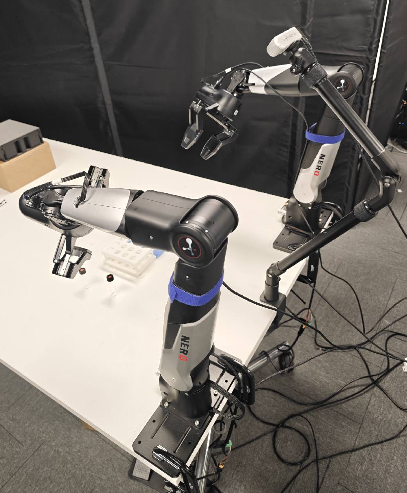
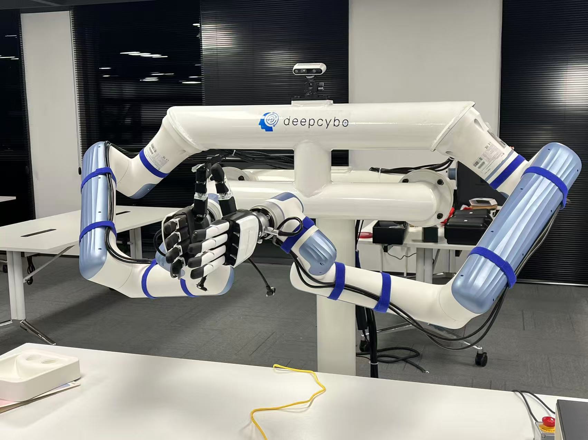
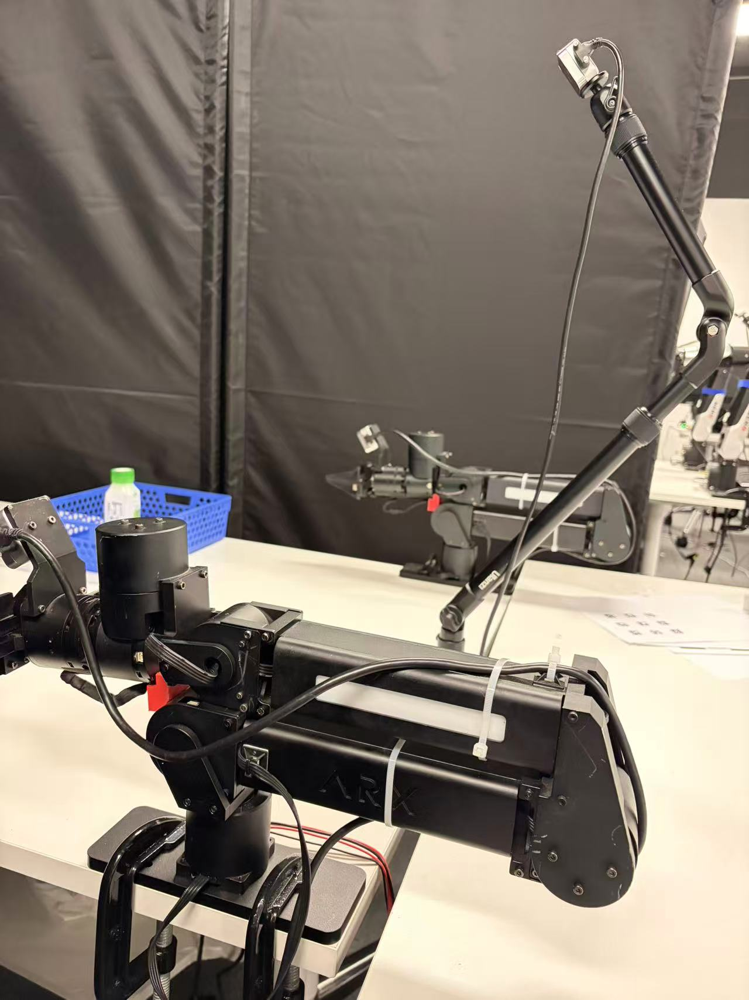

# Dual-Arm Teleoperation for Le-nero

This package is the dual-arm teleoperation and data-collection layer used by Le-nero. It is based on LeRobot and provides robot adapters, Oculus teleoperation, dataset recording/replay/visualization, policy training, and a round-based DAgger loop.

<p align="center">
  
</p>

<p align="center">
  
</p>

<p align="center">
  
</p>

<p align="center">
  
</p>

## Repository Setup and Environment

For a first-time clone, fetch submodules together with the main repository:

```bash
git clone --recurse-submodules https://github.com/Key-Zzs/Le-nero
cd Le-nero
```

If the repository has already been cloned but submodule directories are empty or incomplete, run this from the repository root:

```bash
git submodule sync --recursive
git submodule update --init --recursive
```

To update the main repository and submodules during daily development:

```bash
cd Le-nero
git pull --ff-only
git submodule sync --recursive
git submodule update --init --recursive
git submodule update --remote --merge --recursive
```

To switch the main repository branch:

```bash
git fetch origin
git switch <branch_name>
git submodule update --init --recursive
```

To switch or update this dual-arm teleoperation package:

```bash
cd Le-nero/dual_arm_data_collection/lerobot_dual_arm_teleop
git fetch origin
git switch main
git pull --ff-only
```

Create the Python environment and install both the root repository and this package:

```bash
conda create -n dual_arm_teleop python=3.10 -y
conda activate dual_arm_teleop
python -m pip install --upgrade pip

cd Le-nero
pip install -e .

cd Le-nero/dual_arm_data_collection/lerobot_dual_arm_teleop
pip install -e .
```

Oculus Reader is not managed by the current `.gitmodules`, so it must be cloned separately into the required location:

```bash
cd Le-nero/dual_arm_data_collection/lerobot_dual_arm_teleop/teleoperators/oculus_teleoperator/oculus
git clone https://github.com/rail-berkeley/oculus_reader.git
cd oculus_reader
pip install -e .
```

If the directory already exists, update it and reinstall:

```bash
cd Le-nero/dual_arm_data_collection/lerobot_dual_arm_teleop/teleoperators/oculus_teleoperator/oculus/oculus_reader
git pull --ff-only
pip install -e .
```

Oculus connectivity also requires ADB:

```bash
sudo apt install android-tools-adb
adb devices
```

On the first USB connection, allow USB debugging in the headset. For wireless connection, first use `adb shell ip route` to find the headset IP, then run `adb connect <Oculus_IP>:5555`.

## Core Modules and Runtime Flow

The runtime flow can be understood as:

```text
scripts/config/*.yaml
        |
        v
scripts/core/*.py command entry points
        |
        +--> robots create the real robot interface
        +--> teleoperators create Oculus teleoperation input
        +--> ../../src/lerobot/policies create policy models
        |
        v
LeRobot dataset / train / replay / visualize
```

### Policy Layer

Policy code is located in the root Le-nero repository:

```text
src/lerobot/policies
```

This directory keeps LeRobot policy abstractions and implementations such as `act`, `diffusion`, `smolvla`, and `pi0`. The dual-arm teleoperation scripts mainly use `lerobot.policies.factory.make_policy` and `make_pre_post_processors` to create policy objects and their pre/post-processors.

The most commonly used policy config files in this package are:

- `scripts/policy_config/act_train_config.yaml`: ACT training config.
- `scripts/policy_config/act_reason_config.yaml`: ACT inference/deployment config.
- `scripts/policy_config/diffusion_train_config.yaml`: Diffusion Policy training config.
- `scripts/policy_config/diffusion_reason_config.yaml`: Diffusion Policy inference/deployment config.

`scripts/core/policy_config_utils.py` resolves policy config paths from `record_cfg.yaml`, `train_cfg.yaml`, or `dagger_rounds_cfg.yaml`. Relative paths are resolved first against this package root, and absolute paths are also supported.

### Robot Communication Interface Layer

Robot interfaces are located in:

```text
robots
```

`robots/__init__.py` is the robot registry. The currently registered robot types include:

- `franka`
- `dobot_dual_arm`
- `nero_dual_arm`
- `franka_dual_arm`

Scripts do not instantiate a concrete robot class directly. Instead, they use the configured `robot_type` to call:

```python
create_robot_config(robot_type, **robot_cfg)
create_robot(robot_type, robot_config)
```

Each concrete robot class implements the robot interface expected by LeRobot, such as `connect()`, `reset()`, `send_action()`, camera initialization, observation fields, and action fields. For example, `robots/dual_agilex_nero/nero_dual_arm.py` connects to the dual-arm zerorpc service through `NeroDualArmClient`, then organizes dual-arm end-effector poses, joint states, gripper commands, and RealSense cameras into a LeRobot-compatible data structure.

Hardware-specific parameters should usually live in config files instead of runtime scripts:

```text
scripts/DAS_config
```

For example, `nero_cofig.yaml` defines the Nero robot IP, port, gripper parameters, Oculus mapping, and camera serial numbers. `run_record.py`, `run_replay.py`, and `reset_robot.py` automatically load the corresponding DAS config based on `record.robot_type`. You can also explicitly set `das_config_path` in `record_cfg.yaml`.

### Tool Scripts, Data Collection, and Policy Configs

Main scripts are located in:

```text
scripts
```

Common directories:

- `scripts/core`: command entry implementations for record, replay, visualize, reset, train, and DAgger.
- `scripts/config`: main workflow configs, including `record_cfg.yaml`, `train_cfg.yaml`, and `dagger_rounds_cfg.yaml`.
- `scripts/policy_config`: policy hyperparameter configs, split into train and reason configs.
- `scripts/DAS_config`: hardware and teleoperation detail configs.
- `scripts/tools`: dataset checks, RealSense device checks, dataset patching, renaming, and related utilities.

Core config files:

- `record_cfg.yaml`: main config shared by data collection, policy inference, mixed control, replay, and visualization.
- `train_cfg.yaml`: policy training config, including dataset paths, output directory, GPU settings, batch size, training steps, and wandb.
- `dagger_rounds_cfg.yaml`: round-based DAgger controller config that connects collection, export, and next-round training.
- `*_train_config.yaml`: model structure and training-related hyperparameters used during policy training.
- `*_reason_config.yaml`: model structure, device, and checkpoint parameters used during inference or deployment.

The three `robot-record` modes are controlled by `record.run_mode`:

- `run_record`: pure teleoperation data collection.
- `run_policy`: load a policy checkpoint and let the policy control the robot.
- `run_mix`: policy execution with operator takeover, used for DAgger data collection.

## Core Commands

After installing this package, `setup.py` registers these console commands:

| Command | Purpose | Default config |
| --- | --- | --- |
| `robot-record` | Teleoperation collection, policy execution, or run_mix mixed collection | `scripts/config/record_cfg.yaml` |
| `robot-replay` | Replay a collected episode | `scripts/config/record_cfg.yaml` `replay` section |
| `robot-visualize` | Visualize a dataset episode with Rerun | `scripts/config/record_cfg.yaml` `visualize` section |
| `robot-reset` | Connect to the configured robot and return it home | `scripts/config/record_cfg.yaml` |
| `robot-train` | Train ACT or Diffusion Policy | `scripts/config/train_cfg.yaml` |
| `robot-dagger` | Run round-based DAgger: collect, export, then train the next-round policy | `scripts/config/dagger_rounds_cfg.yaml` |
| `robot-dagger-export` | Export DAgger training data from raw run_mix logs | `scripts/config/dagger_rounds_cfg.yaml` `dagger_export` section |
| `tools-check-dataset` | Inspect local LeRobot dataset information | Command arguments |
| `tools-check-dagger-dataset` | Inspect an exported DAgger dataset | Command arguments |
| `tools-check-rs` | Show RealSense device serial numbers | None |
| `robot-help` | Print the command summary | None |

All core commands support an explicit config file. It is recommended to pass the path during debugging:

```bash
robot-record --config scripts/config/record_cfg.yaml
robot-replay --config scripts/config/record_cfg.yaml
robot-visualize --config scripts/config/record_cfg.yaml
robot-reset --config scripts/config/record_cfg.yaml
robot-train --config scripts/config/train_cfg.yaml
robot-dagger --config scripts/config/dagger_rounds_cfg.yaml
robot-dagger-export --config scripts/config/dagger_rounds_cfg.yaml
```

## Configuration Checklist

Before data collection, usually edit `scripts/config/record_cfg.yaml`:

- `record.repo_id`: dataset name. Recommended format: `<robot_task<num>_step<num>/<description>`, for example `nero_task3_step1/2mL_empty_right`.
- `record.robot_type`: choose a robot type such as `nero_dual_arm` or `franka_dual_arm`.
- `record.run_mode`: choose `run_record`, `run_policy`, or `run_mix`.
- `record.policy.type`, `config_path`, `pretrained_path`: required only for `run_policy` or `run_mix`.
- `record.task`: task description, number of episodes, resume behavior, and whether to record success labels.
- `record.time`: max episode duration, reset duration, and metadata save period.
- `replay`, `visualize`: default dataset and episode used by replay and visualization.

Hardware parameters are usually edited in `scripts/DAS_config/*.yaml`:

- `teleop.oculus_config.ip`: Oculus Quest IP.
- `teleop.oculus_config.*_pose_scaler` and `*_channel_signs`: mapping from left/right controllers to robot actions.
- `robot.robot_ip`, `robot.robot_port`: robot service address.
- `robot.use_gripper` and gripper parameters: enable grippers, close/open thresholds, max opening width, and force.
- `cameras.*_serial`, `width`, `height`: RealSense serial numbers and resolution.

Before training, usually edit `scripts/config/train_cfg.yaml`:

- `train.dataset.repo_id` and `train.dataset.root`: training dataset.
- `train.policy.type` and `train.policy.config_path`: policy type and training config.
- `train.output_dir`, `job_name`: model and log output location.
- `train.training`: visible GPUs, memory cap, TF32, and other training device settings.
- `train.steps`, `batch_size`, `num_workers`, `save_freq`: training scale.
- `train.wandb`: wandb project and mode.

Before DAgger, usually edit `scripts/config/dagger_rounds_cfg.yaml`:

- `dagger_rounds.seed_repo_id` or `seed_dataset_path`: seed dataset used by round 0.
- `dagger_rounds.initial_pretrained_path`: optional initial checkpoint, if one already exists.
- `dagger_rounds.policy`: policy type used in rounds, plus train/reason config paths.
- `dagger_rounds.episodes_per_round`, `num_rounds`, `round_schedule`: collection count per round, number of rounds, and training step schedule.
- `dagger_rounds.output_root`: DAgger round output directory.
- `dagger_rounds.record_cfg_path`, `train_cfg_path`: base configs dynamically modified and called by the controller.
- `dagger_rounds.policy_backend.export`: rules for exporting run_mix logs into training data.

## Oculus Setup and Controls

### Install and Test Oculus Reader

```bash
cd Le-nero/dual_arm_data_collection/lerobot_dual_arm_teleop
cd teleoperators/oculus_teleoperator/oculus/oculus_reader
pip install -e .
python oculus_reader/reader.py
```

### Install the Oculus Reader APK

```bash
cd Le-nero/dual_arm_data_collection/lerobot_dual_arm_teleop
cd teleoperators/oculus_teleoperator/oculus/oculus_reader/oculus_reader/APK
adb install -r teleop-debug.apk
```

After installation, the app appears in the Oculus Quest library under **Unknown Sources**.

### Configure Oculus Teleoperation

Set the Oculus IP and mapping in the selected DAS config, for example `scripts/DAS_config/nero_cofig.yaml`:

```yaml
teleop:
  control_mode: "oculus"
  dual_arm: true
  oculus_config:
    ip: "192.168.110.62"
    use_gripper: true
    left_pose_scaler: [1.2, 1.2]
    right_pose_scaler: [1.2, 1.2]
    left_channel_signs: [-1, -1, 1, 1, 1, 1]
    right_channel_signs: [-1, -1, 1, 1, 1, 1]
```

### Controller Controls

| Control | Function |
| --- | --- |
| Left grip `LG` | Hold to enable left-arm end-effector motion. In `run_mix`, this starts or continues expert override for the left arm. |
| Right grip `RG` | Hold to enable right-arm end-effector motion. In `run_mix`, this starts or continues expert override for the right arm. |
| Left trigger `LTr` | Control the left gripper. Pressing closes the gripper; releasing opens it. |
| Right trigger `RTr` | Control the right gripper. Pressing closes the gripper; releasing opens it. |
| `Y` button | In `run_mix`, release the left gripper channel back to policy control. |
| `B` button | In `run_mix`, release the right gripper channel back to policy control. |
| `A` button | Request robot reset, if supported by the active teleoperator/robot implementation. |
| Controller pose | Controls the corresponding end-effector delta pose while the corresponding grip is held. |

If `mirror_teleop` is enabled, the left/right controller assignment is swapped and pose deltas are mirrored before being sent to the robot.

### DAgger/run_mix Controller Definitions

- Policy is the default controller. Human input overrides only the channels being actively controlled.
- Holding `LG` or `RG` makes the corresponding arm an expert override. The first override frame is marked as `takeover_start`; continued override frames are marked as `recovery`.
- `LTr` and `RTr` control grippers independently from arm motion. Gripper takeover uses soft takeover: the trigger command must match the current held gripper value before manual gripper control becomes active, which avoids sudden jumps.
- Press `Y` for the left gripper or `B` for the right gripper to hand that gripper back to the policy. The trigger must be released before that gripper can be manually reacquired.
- Use the left arrow to discard failed, incomplete, low-quality, or not-trainable episodes before saving. This is required when `full_episode.success_policy` is `recorded_is_success`.

### Coordinate Mapping

The exact mapping is configured by `*_pose_scaler` and `*_channel_signs`. A common Oculus-to-robot mapping is:

| Oculus axis | Robot axis | Description |
| --- | --- | --- |
| X right | -Y left | Lateral movement |
| Y up | Z up | Vertical movement |
| Z backward | X forward | Forward/backward movement |

### Troubleshooting

```bash
# Restart ADB server
adb kill-server
adb start-server

# Check connected devices
adb devices

# Stop the Oculus app
adb shell am force-stop com.rail.oculus.teleop

# Reinstall APK
adb uninstall com.rail.oculus.teleop
adb install -r teleoperators/oculus_teleoperator/oculus/oculus_reader/oculus_reader/APK/teleop-debug.apk
```

## Common Workflow

```bash
cd Le-nero/dual_arm_data_collection/lerobot_dual_arm_teleop

# 1. Show camera serial numbers and fill them into scripts/DAS_config/*.yaml
tools-check-rs

# 2. Check that policy configs resolve correctly. Recommended before run_policy/run_mix
robot-record --config scripts/config/record_cfg.yaml --dry-run-policy-config

# 3. Connect to the robot and return it home
robot-reset --config scripts/config/record_cfg.yaml

# 4. Collect teleoperation data
robot-record --config scripts/config/record_cfg.yaml

# 5. Visualize or replay data
robot-visualize --config scripts/config/record_cfg.yaml
robot-replay --config scripts/config/record_cfg.yaml

# 6. Train a policy
robot-train --config scripts/config/train_cfg.yaml

# 7. Run the round-based DAgger loop
robot-dagger --config scripts/config/dagger_rounds_cfg.yaml
```

## Dataset Operations

### Record, Replay, and Visualize

```bash
robot-record --config scripts/config/record_cfg.yaml
robot-replay --config scripts/config/record_cfg.yaml
robot-visualize --config scripts/config/record_cfg.yaml
```

<p align="center">
  
  <br>
  <b>Figure 1: Record</b>
</p>

<p align="center">
  
  <br>
  <b>Figure 2: Visualization</b>
</p>

### Resume Recording

If a dataset already exists under the target `repo_id`, set `record.task.resume: true` and configure `record.task.resume_dataset` in `record_cfg.yaml`, then run:

```bash
robot-record --config scripts/config/record_cfg.yaml
```

### Upload to Hugging Face

Set `record.storage.push_to_hub: true` in `record_cfg.yaml`, then log in:

```bash
huggingface-cli login --token ${HUGGINGFACE_TOKEN}
huggingface-cli whoami
```

### Merge Datasets

```bash
lerobot-edit-dataset \
    --repo_id <merged_repo_id> \
    --operation.type merge \
    --operation.repo_ids "['<repo_id_1>', '<repo_id_2>']"
```

For more dataset processing commands, see the LeRobot dataset tools documentation.

## Dataset Naming and Local Metadata

<p align="center">
  
  <br>
  <b>Figure 3: Dataset</b>
</p>

<p align="center">
  
  <br>
  <b>Figure 4: Dataset Info</b>
</p>

LeRobot datasets are stored under `~/.cache/huggingface/lerobot` by default unless `dataset_path` or `dataset_root` is configured. Local dataset metadata may include:

- `dataset_info.txt`: local dataset records such as `record_id`, `name`, `task`, `date`, `version`, `user_info`, and `type`.
- `dataset_info_backup`: backups created when `tools-check-dataset` updates `dataset_info.txt`.
- Dataset folders: the actual LeRobot dataset contents.

If datasets were manually deleted or moved, refresh local metadata with:

```bash
tools-check-dataset
```

## Training, Evaluation, and DAgger

### Training

Edit `scripts/config/train_cfg.yaml`, then run:

```bash
robot-train --config scripts/config/train_cfg.yaml
```

### Policy Evaluation

Set `record.run_mode: run_policy` in `scripts/config/record_cfg.yaml`, configure `record.policy.type`, `record.policy.config_path`, and `record.policy.pretrained_path`, then run:

```bash
robot-record --config scripts/config/record_cfg.yaml
```

### DAgger Full-Episode Success Policy

`full_success_episode` and `hybrid` exports with full episodes use `full_episode.success_policy` in `dagger_rounds_cfg.yaml`:

- `explicit`: strict mode. Each saved run_mix episode asks for a manual success label.
- `recorded_is_success`: saved means successful. This fits the workflow where failed, incomplete, low-quality, or not-trainable episodes are discarded with the left arrow before saving.
- `allow_missing_for_smoke`: debugging only. Missing success labels are allowed with a warning and should not be used for real training.

When using `recorded_is_success`, the operator must be strict about deleting any episode that should not become a full demonstration. The success labels can later support VLA, Diffusion Policy, failure-detector filtering, and evaluation.

## Recording Control Keys

Common key controls during collection:

- Right arrow: stop the current episode and save it.
- Left arrow: discard the current episode.
- Esc: stop the recording session.
- Enter: continue to the next teleoperation segment or next episode.
- Ctrl+C: interrupt and clean up the incomplete dataset.
