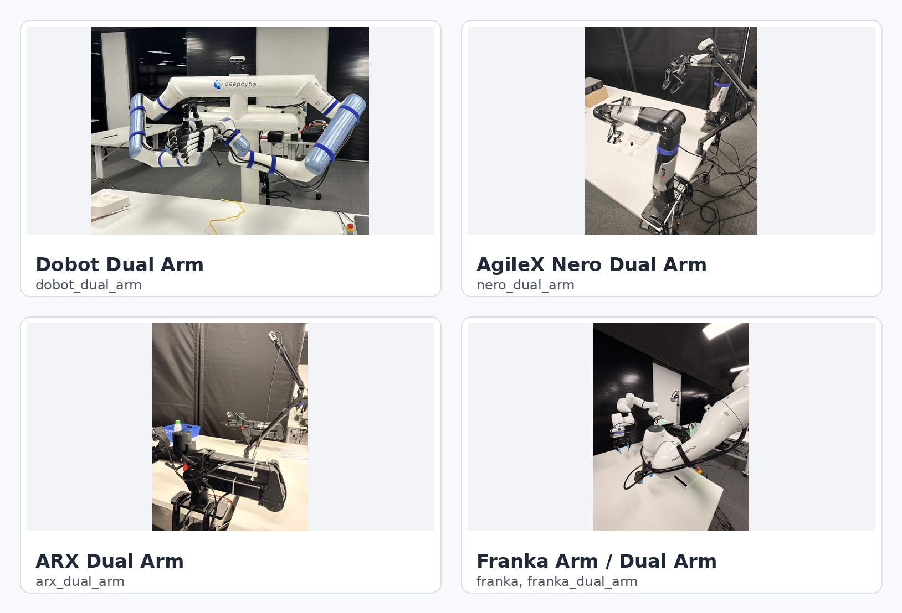
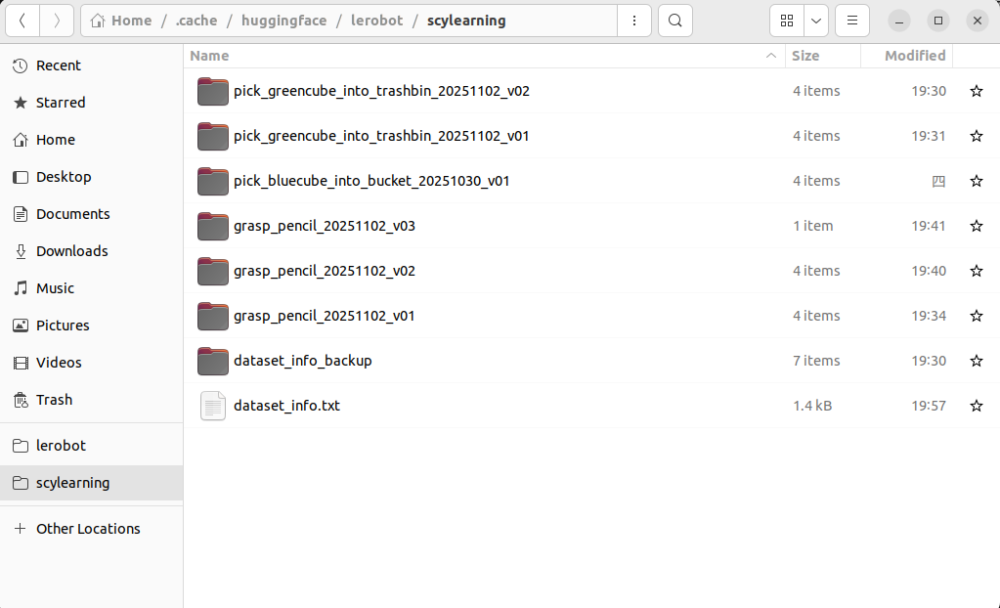
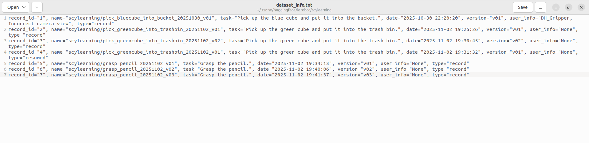

# Dual Arm Teleoperation 双臂遥操作

本项目用于双臂遥操作、数据采集、回放/可视化、策略训练和轮次式 DAgger 闭环。项目使用 `Key-Zzs/Le-nero` 提供的 `lerobot` 包作为数据集、策略和 DAgger 相关实现，并使用本仓库自己的机器人和遥操作适配层。

<p align="center">
  
</p>

当前注册表支持以下机器人适配器：Dobot 双臂、AgileX Nero 双臂、ARX 双臂、Franka 单臂/双臂，以及 Flexiv Rizon4s 双臂。对应的 `robot_type` 分别是 `dobot_dual_arm`、`nero_dual_arm`、`arx_dual_arm`、`franka`、`franka_dual_arm` 和 `flexiv_dual_arm`。

## 仓库获取与环境配置

首次拉取仓库：

```bash
git clone https://github.com/Shenzhaolong1330/dual_arm_teleop.git
cd dual_arm_teleop
```

日常更新本仓库：

```bash
cd dual_arm_teleop
git pull --ff-only
```

切换分支：

```bash
git fetch origin
git switch <branch_name>
```

创建 Python 环境，先安装 Le-nero，再安装本包：

```bash
conda create -n dual_arm_teleop python=3.10 -y
conda activate dual_arm_teleop
python -m pip install --upgrade pip

# 先安装 Le-nero。它提供本项目策略和 DAgger 流程需要的 lerobot 包。
git clone https://github.com/Key-Zzs/Le-nero.git
cd Le-nero
pip install -e .

cd /path/to/dual_arm_teleop
pip install -e .
```

如果本地已经 clone 过 `Le-nero`，直接使用已有 checkout 即可。这里应安装 `Key-Zzs/Le-nero`，而不是上游原版 LeRobot，因为本项目的策略和 DAgger 流程依赖 Le-nero 中的内容。

Oculus Reader 不随本仓库 vendored，需要单独 clone 到指定目录：

```bash
cd /path/to/dual_arm_teleop/teleoperators/oculus_teleoperator/oculus
git clone https://github.com/rail-berkeley/oculus_reader.git
cd oculus_reader
pip install -e .
```

如果该目录已经存在，只需要更新并重新安装：

```bash
cd /path/to/dual_arm_teleop/teleoperators/oculus_teleoperator/oculus/oculus_reader
git pull --ff-only
pip install -e .
```

Oculus 连接还需要 ADB：

```bash
sudo apt install android-tools-adb
adb devices
```

首次 USB 连接时需要在头显中允许 USB 调试；无线连接时可以先通过 `adb shell ip route` 查看头显 IP，再执行`adb tcpip 5555` 和 `adb connect <Oculus_IP>:5555`。

## 核心模块与调用机理

运行链路可以简化理解为：

```text
scripts/config/*.yaml
        |
        v
scripts/core/*.py 命令入口
        |
        +--> robots 创建真实机器人接口
        +--> teleoperators 创建 Oculus 遥操作输入
        +--> Le-nero 的 lerobot.policies 创建策略模型
        |
        v
Le-nero 提供的 lerobot dataset / train / replay / visualize
```

### 策略层

策略和 DAgger 实现来自已安装的 `Key-Zzs/Le-nero` 仓库，它提供本项目使用的 `lerobot` Python 包：

```text
lerobot.policies
```

这个包里保留策略抽象和具体实现，例如 `act`、`diffusion`、`smolvla`、`pi0` 等，也包含训练和 DAgger 流程需要的项目相关行为。双臂遥操作脚本主要通过 `lerobot.policies.factory.make_policy` 和 `make_pre_post_processors` 创建策略对象及前后处理器。

本包最常用的策略配置文件是：

- `scripts/config/policies/act_train_config.yaml`：ACT 训练配置。
- `scripts/config/policies/act_reason_config.yaml`：ACT 推理/部署配置。
- `scripts/config/policies/diffusion_train_config.yaml`：Diffusion Policy 训练配置。
- `scripts/config/policies/diffusion_reason_config.yaml`：Diffusion Policy 推理/部署配置。

`scripts/core/policy_config_utils.py` 负责解析 `record_cfg.yaml`、`train_cfg.yaml` 或 `dagger_rounds_cfg.yaml` 中的策略配置路径。相对路径会优先按本包根目录解析，也支持直接写绝对路径。

### 机器人通讯接口定义层

机器人接口位于：

```text
robots
```

`robots/__init__.py` 是机器人注册表，当前注册的类型包括：

- `franka`
- `dobot_dual_arm`
- `nero_dual_arm`
- `arx_dual_arm`
- `franka_dual_arm`
- `flexiv_dual_arm`

脚本不会直接实例化某个具体机器人类，而是根据配置中的 `robot_type` 调用：

```python
create_robot_config(robot_type, **robot_cfg)
create_robot(robot_type, robot_config)
```

本包的 `robot-*` 命令使用仓库内自己的 `robots` 和 `teleoperators` 注册表。现在不再保留 `lerobot_robot_*` 或 `lerobot_teleoperator_*` 这类顶层 LeRobot 插件 shim 包，因此不提供上游 LeRobot CLI `register_third_party_devices()` 的自动发现别名。

具体机器人类负责实现 LeRobot 期望的机器人接口，例如 `connect()`、`reset()`、`send_action()`、相机初始化、观测字段和动作字段定义。以 `nero_dual_arm` 为例，`robots/dual_agilex_nero/nero_dual_arm.py` 通过 `NeroDualArmClient` 连接双臂 zerorpc 服务，并把双臂末端位姿、关节状态、夹爪命令和 RealSense 相机组织成 LeRobot 可记录的数据结构。`robots/dual_flexiv_rizon4s/flexiv_dual_arm.py` 通过 Flexiv RDK 支持 Flexiv Rizon4s 双臂，会从 `scripts/config/robots/flexiv_config.yaml` 读取左右机械臂序列号、Flexiv 夹爪/工具名称、笛卡尔运动限制、home 关节角和 RealSense 相机配置。

硬件相关参数不建议直接写在运行脚本里，而是放在：

```text
scripts/config/robots
```

默认机器人配置映射如下：

- `dobot_dual_arm`：`scripts/config/robots/dobot_config.yaml`
- `nero_dual_arm`：`scripts/config/robots/nero_cofig.yaml`
- `arx_dual_arm`：`scripts/config/robots/arx_config.yaml`
- `franka`、`franka_dual_arm`：`scripts/config/robots/franka_config.yaml`
- `flexiv_dual_arm`：`scripts/config/robots/flexiv_config.yaml`

每个文件定义对应硬件的连接信息、夹爪参数、Oculus 映射和相机序列号。`run_record.py`、`run_replay.py`、`reset_robot.py` 会根据 `record.robot_type` 自动加载对应机器人配置；也可以在 `record_cfg.yaml` 中通过 `das_config_path` 显式指定。

### 工具脚本、数采系统与策略配置

主要脚本位于：

```text
scripts
```

常用目录含义：

- `scripts/core`：命令入口实现，包括采集、回放、可视化、重置、训练、DAgger。
- `scripts/config`：主流程配置，包含 `record_cfg.yaml`、`train_cfg.yaml`、`dagger_rounds_cfg.yaml` 和数据集工具配置。
- `scripts/config/policies`：策略超参数配置，区分 train 和 reason 两类。
- `scripts/config/robots`：硬件和遥操作细节配置。
- `scripts/tools`：数据集检查、RealSense 设备检查、数据集修补和重命名等工具。

核心配置文件：

- `record_cfg.yaml`：数据采集、策略推理、混合控制、回放和可视化共用的主配置。
- `train_cfg.yaml`：策略训练配置，包括数据集路径、输出目录、GPU、batch size、训练步数和 wandb。
- `dagger_rounds_cfg.yaml`：轮次式 DAgger 控制器配置，负责把采集、导出、训练串成闭环。
- `preprocess_dataset_cfg.yaml`：数据集清理、静止片段压缩和动作平滑配置。
- `split_label_dataset_cfg.yaml`：长 episode 切分、语义标注和 VLA manifest 配置。
- `merge_dataset_cfg.yaml`：把多个本地 LeRobot 数据集合并为一个输出数据集。
- `*_train_config.yaml`：策略训练时使用的模型结构和训练相关超参数。
- `*_reason_config.yaml`：策略推理或部署时使用的模型结构、设备和 checkpoint 参数。

`robot-record` 的三种运行模式由 `record.run_mode` 控制：

- `run_record`：纯遥操作采集。
- `run_policy`：加载策略 checkpoint，由策略控制机器人。
- `run_mix`：策略执行为主，操作者可接管，用于 DAgger 数据采集。

## 核心命令

安装本包后，`setup.py` 会注册以下命令：

| 命令 | 作用 | 默认配置 |
| --- | --- | --- |
| `robot-record` | 遥操作采集、策略执行或 run_mix 混合采集 | `scripts/config/record_cfg.yaml` |
| `robot-replay` | 回放已采集 episode | `scripts/config/record_cfg.yaml` 的 `replay` 段 |
| `robot-visualize` | 用 Rerun 可视化数据集 episode | `scripts/config/record_cfg.yaml` 的 `visualize` 段 |
| `robot-reset` | 根据配置连接机器人并回 home | `scripts/config/record_cfg.yaml` |
| `robot-train` | 训练 ACT 或 Diffusion Policy | `scripts/config/train_cfg.yaml` |
| `robot-dagger` | 运行轮次式 DAgger：采集、导出、训练下一轮策略 | `scripts/config/dagger_rounds_cfg.yaml` |
| `robot-dagger-export` | 从 raw run_mix 日志单独导出 DAgger 训练数据 | `scripts/config/dagger_rounds_cfg.yaml` 的 `dagger_export` 段 |
| `tools-check-dataset` | 清理本地 `dataset_info.txt` 中已不存在的数据集记录 | `scripts/config/record_cfg.yaml` |
| `tools-check-dagger-dataset` | 训练前审计导出的 DAgger 数据集 | `scripts/config/dagger_rounds_cfg.yaml`、`scripts/config/train_cfg.yaml` |
| `tools-check-rs` | 查看 RealSense 设备序列号 | 无 |
| `tools-preprocess-dataset` | 基于 `observation.state` 变化率压缩静止片段、可选平滑动作，并通过 LeRobot API 重写数据集 | `scripts/config/preprocess_dataset_cfg.yaml` |
| `tools-split-label-dataset` | 将长 episode 切分为带语义标签的子 episode，可选按 state 变化率过滤静止段并写新数据集 | `scripts/config/split_label_dataset_cfg.yaml` |
| `tools-merge-datasets` | 将多个 schema 一致的本地 LeRobot 数据集合并为一个实体数据集 | `scripts/config/merge_dataset_cfg.yaml` |
| `robot-help` | 打印命令摘要 | 无 |

所有核心命令和配置驱动的数据集工具都支持显式传入配置文件，推荐调试时总是写明路径：

```bash
robot-record --config scripts/config/record_cfg.yaml
robot-replay --config scripts/config/record_cfg.yaml
robot-visualize --config scripts/config/record_cfg.yaml
robot-reset --config scripts/config/record_cfg.yaml
robot-train --config scripts/config/train_cfg.yaml
robot-dagger --config scripts/config/dagger_rounds_cfg.yaml
robot-dagger-export --config scripts/config/dagger_rounds_cfg.yaml
tools-preprocess-dataset --config scripts/config/preprocess_dataset_cfg.yaml --dry-run
tools-split-label-dataset --config scripts/config/split_label_dataset_cfg.yaml --dry-run
tools-merge-datasets --config scripts/config/merge_dataset_cfg.yaml --dry-run
```

## 工具命令与维护脚本

已注册的工具命令如下：

| 命令 | 常用用法 | 说明 |
| --- | --- | --- |
| `tools-check-rs` | `tools-check-rs` | 需要 `pyrealsense2`；打印已连接 RealSense 的名称和序列号。 |
| `tools-check-dataset` | `tools-check-dataset --config scripts/config/record_cfg.yaml` | 删除本地记录中实际文件夹已不存在的数据集条目；可用 `--lerobot-home` 覆盖数据集缓存根目录。 |
| `tools-check-dagger-dataset` | `tools-check-dagger-dataset --config scripts/config/dagger_rounds_cfg.yaml --train-config scripts/config/train_cfg.yaml` | 审计 DAgger 导出数据、schema、动作值、source 标签和训练兼容性。 |
| `tools-preprocess-dataset` | `tools-preprocess-dataset --config scripts/config/preprocess_dataset_cfg.yaml --dry-run` | 支持 `--overwrite` 和 `--max-episodes`；默认用 `observation.state` 变化率压缩静止段，夹爪状态变化也算 motion；连续静止至少 10 帧才会被压缩；可选平滑动作，并通过 LeRobot API 写出清理后的数据集。 |
| `tools-split-label-dataset` | `tools-split-label-dataset --config scripts/config/split_label_dataset_cfg.yaml --dry-run` | 支持 `--label-only`、`--write-dataset`、`--overwrite`、`--max-episodes` 和 `--resume-cache`；静止段过滤默认使用 `observation.state` 变化率，夹爪状态变化也会保留；连续静止至少 10 帧才会被裁剪。 |
| `tools-merge-datasets` | `tools-merge-datasets --config scripts/config/merge_dataset_cfg.yaml --dry-run` | 合并 `source.parent_dir` 下 `source.datasets` 列出的数据集；支持 `--overwrite` 和 `--max-episodes`。 |

以下维护脚本未注册为 console command，但可在本包根目录直接运行：

| 脚本 | 常用用法 | 作用 |
| --- | --- | --- |
| `scripts/tools/rename_lerobot_task.py` | `python scripts/tools/rename_lerobot_task.py --dataset-root <dataset> --new-task "<task>" --dry-run` | 重命名单个数据集里的 task prompt，并同步 `meta/tasks.parquet`、episode metadata 和可选 `dataset_info.txt`。 |
| `scripts/tools/merge_lerobot_tasks.py` | `python scripts/tools/merge_lerobot_tasks.py --dataset-root <dataset> --source-task "<old>" --target-task "<keep>" --dry-run` | 将单个数据集里的一个 task 标签合并到另一个 task 标签。 |
| `scripts/tools/patch_lerobot_dataset_metadata.py` | `python scripts/tools/patch_lerobot_dataset_metadata.py --dataset-root <dataset> --check-only` | 检查或修补数据集 description、repo id 等显式 metadata 字段。 |
| `scripts/tools/run_dagger_export_train_experiment.py` | `python scripts/tools/run_dagger_export_train_experiment.py --raw-dataset <raw> --base-dataset <seed_or_agg> --initial-checkpoint <ckpt> --output-root <out> --dry-run` | 针对不同 DAgger export mode 跑导出/训练实验。 |
| `scripts/core/check_dagger_sampling.py` | `python scripts/core/check_dagger_sampling.py --dataset <aggregated_dataset>` | 检查 source-aware DAgger sampler 权重。 |
| `scripts/tools/check_robotiq_ports.sh` | `bash scripts/tools/check_robotiq_ports.sh --verbose` | 在 `/dev/serial/by-id` 下查找疑似 Robotiq 夹爪串口；也支持 `--json`。 |
| `scripts/tools/map_gripper.sh` | `sudo bash scripts/tools/map_gripper.sh dobot_left_gripper` | 给单个已连接 USB 夹爪创建 udev 软链接。 |
| `rm_tmp.sh` | `bash rm_tmp.sh` | 清理本包内 Python cache 和构建产物。 |

数据集工具请在平时运行 Le-nero/lerobot 采集和训练的环境里执行。部分工具启动时会导入 `lerobot`、`numpy`、`torch`、`pyarrow`、`pandas`、`pyrealsense2` 或硬件 SDK。

## 配置检查清单

采集前通常需要修改 `scripts/config/record_cfg.yaml`：

- `record.repo_id`：数据集名称，建议使用 `<robot_task<num>_step<num>/<description>`，例如 `nero_task3_step1/2mL_empty_right`。
- `record.robot_type`：选择 `nero_dual_arm`、`franka_dual_arm`、`flexiv_dual_arm` 等机器人类型。
- `record.run_mode`：选择 `run_record`、`run_policy` 或 `run_mix`。
- `record.save_depth_sidecar`、`record.save_ir_sidecar`、`record.save_rgbd_timestamps`：把 RealSense 原生 depth、左右 IR、`global_frame_index`、`robot_timestamp` 和每个相机的 RGB-D timestamp 保存为非 image 的 parquet sidecar 字段。
- `record.rgb_camera_name_mode`：`rgb` 会把 RGB 视频保存为 `observation.images.head_rgb`、`observation.images.left_wrist_rgb`、`observation.images.right_wrist_rgb`；只有旧 checkpoint 仍依赖历史 `*_image` key 时才改成 `legacy_image`。
- `record.policy.type`、`config_path`、`pretrained_path`：仅在 `run_policy` 或 `run_mix` 时需要确认。
- `record.task`：任务描述、episode 数量、是否 resume、是否记录 success。
- `record.time`：episode 最大时长、reset 时长和 metadata 保存周期。
- `replay`、`visualize`：回放和可视化默认使用的数据集和 episode。

硬件参数通常在 `scripts/config/robots/*.yaml` 中修改：

- `teleop.oculus_config.ip`：Oculus Quest IP。
- `teleop.oculus_config.*_pose_scaler` 和 `*_channel_signs`：左右手柄到机器人动作的映射。
- `robot.robot_ip`、`robot.robot_port`：基于 RPC 的机器人服务地址。
- 对于 `flexiv_dual_arm`，需要在 `scripts/config/robots/flexiv_config.yaml` 中填写 `robot.left_robot_sn`、`robot.right_robot_sn`、Flexiv 夹爪/工具名称、home 关节角和笛卡尔安全限制。真实硬件控制还要求当前 Python 环境安装 `flexivrdk` 和 `spdlog`。
- `robot.use_gripper` 和夹爪参数：夹爪启用、开合阈值、最大开口和力。
- `cameras.*_serial`、`width`、`height`：RealSense 序列号和分辨率。

RGB-D sidecar 采集方式是：RGB 保持为标准 LeRobot video 字段，depth/IR 保存为 `sidecar.head_depth`、`sidecar.head_left_ir`、`sidecar.head_right_ir` 等 parquet 数组字段。Flexiv 相机后台线程读失败时会复用上一组有效 RGB-D/IR frameset，并在对应 `*_rgbd_reused` 字段标记；如果启动阶段从未读到有效 frameset，则直接失败，不写空帧。

训练前通常需要修改 `scripts/config/train_cfg.yaml`：

- `train.dataset.repo_id` 和 `train.dataset.root`：训练数据集。
- `train.policy.type` 和 `train.policy.config_path`：策略类型和训练配置。
- `train.output_dir`、`job_name`：模型和日志输出位置。
- `train.training`：GPU 可见卡、显存限制、TF32 等训练设备设置。
- `train.steps`、`batch_size`、`num_workers`、`save_freq`：训练规模。
- `train.wandb`：wandb 项目和模式。

DAgger 前通常需要修改 `scripts/config/dagger_rounds_cfg.yaml`：

- `dagger_rounds.seed_repo_id` 或 `seed_dataset_path`：round 0 使用的种子数据集。
- `dagger_rounds.initial_pretrained_path`：可选，已有初始 checkpoint 时填写。
- `dagger_rounds.policy`：轮次中使用的策略类型，以及 train/reason 配置路径。
- `dagger_rounds.episodes_per_round`、`num_rounds`、`round_schedule`：每轮采集数量、轮数和训练步数策略。
- `dagger_rounds.output_root`：DAgger 轮次输出目录。
- `dagger_rounds.record_cfg_path`、`train_cfg_path`：被控制器动态改写并调用的基础配置。
- `dagger_rounds.policy_backend.export`：run_mix 日志导出为训练数据的规则。

## Oculus 设置与控制

### 安装并测试 Oculus Reader

```bash
cd /path/to/dual_arm_teleop
cd teleoperators/oculus_teleoperator/oculus/oculus_reader
pip install -e .
python oculus_reader/reader.py
```

### 安装 Oculus Reader APK

```bash
cd /path/to/dual_arm_teleop
cd teleoperators/oculus_teleoperator/oculus/oculus_reader/oculus_reader/APK
adb install -r teleop-debug.apk
```

安装完成后，应用将出现在 Oculus Quest 库中的 **未知来源** 下。

### 配置 Oculus 遥操作

在所选机器人配置中设置 Oculus IP 和映射参数，例如 `scripts/config/robots/nero_cofig.yaml` 或 `scripts/config/robots/flexiv_config.yaml`：

```yaml
teleop:
  control_mode: "oculus"
  dual_arm: true
  oculus_config:
    ip: "192.168.110.62"
    use_gripper: true
    left_pose_scaler: [1.2, 1.2]
    right_pose_scaler: [1.2, 1.2]
    left_channel_signs: [-1, -1, 1, 1, 1, 1]
    right_channel_signs: [-1, -1, 1, 1, 1, 1]
```

### 控制器按键

| 控制键 | 功能 |
| --- | --- |
| 左握持键 `LG` | 按住以启动左臂末端运动。在 `run_mix` 中会开始或持续左臂专家接管。 |
| 右握持键 `RG` | 按住以启动右臂末端运动。在 `run_mix` 中会开始或持续右臂专家接管。 |
| 左扳机 `LTr` | 控制左夹爪；按下关闭，松开打开。 |
| 右扳机 `RTr` | 控制右夹爪；按下关闭，松开打开。 |
| `Y` 按钮 | 在 `run_mix` 中将左夹爪通道交还给策略控制。 |
| `B` 按钮 | 在 `run_mix` 中将右夹爪通道交还给策略控制。 |
| `A` 按钮 | 在当前 teleoperator/robot 实现支持时请求机器人复位。 |
| 控制器位姿 | 在对应握持键按住时，控制对应机械臂的末端增量位姿。 |

如果启用了 `mirror_teleop`，左右控制器的对应关系会交换，并在发送给机器人前对位姿增量做镜像。

### DAgger/run_mix 控制定义

- 默认由策略控制机器人；人工输入只覆盖正在主动控制的通道。
- 按住 `LG` 或 `RG` 会让对应手臂进入专家接管。接管的第一帧标记为 `takeover_start`，持续接管帧标记为 `recovery`。
- `LTr` 和 `RTr` 独立控制夹爪，不要求同时接管手臂。夹爪接管使用 soft takeover：扳机命令需要先接近当前保持的夹爪值，手动夹爪控制才会生效，避免夹爪突然跳变。
- 按 `Y` 可将左夹爪交还给策略，按 `B` 可将右夹爪交还给策略；交还后需要先松开对应扳机，才能再次手动接管该夹爪。
- 使用左箭头丢弃失败、不完整、质量差或不适合作为训练示范的 episode。`full_episode.success_policy` 为 `recorded_is_success` 时，这一点尤其重要。

### 坐标系映射

实际映射由 `*_pose_scaler` 和 `*_channel_signs` 配置。常见 Oculus 到机器人坐标映射如下：

| Oculus 轴 | 机器人轴 | 描述 |
| --- | --- | --- |
| X 向右 | -Y 向左 | 横向移动 |
| Y 向上 | Z 向上 | 垂直移动 |
| Z 向后 | X 向前 | 前后移动 |

### 故障排除

```bash
# 重启 ADB 服务器
adb kill-server
adb start-server

# 检查已连接设备
adb devices

# 停止 Oculus 应用
adb shell am force-stop com.rail.oculus.teleop

# 重新安装 APK
adb uninstall com.rail.oculus.teleop
adb install -r teleoperators/oculus_teleoperator/oculus/oculus_reader/oculus_reader/APK/teleop-debug.apk
```

## 常用流程

```bash
cd /path/to/dual_arm_teleop

# 1. 查看相机序列号，填入 scripts/config/robots/*.yaml
tools-check-rs

# 2. 检查策略配置能否正常解析，run_policy/run_mix 前推荐执行
robot-record --config scripts/config/record_cfg.yaml --dry-run-policy-config

# 3. 连接机器人并回 home
robot-reset --config scripts/config/record_cfg.yaml

# 4. 遥操作采集数据
robot-record --config scripts/config/record_cfg.yaml

# 5. 可视化或回放数据
robot-visualize --config scripts/config/record_cfg.yaml
robot-replay --config scripts/config/record_cfg.yaml

# 检查 RGB-D/IR sidecar 字段
python scripts/check_rgbd_sidecar_dataset.py --repo-id <your_repo_id>

# 6. 训练策略
robot-train --config scripts/config/train_cfg.yaml

# 7. 运行 DAgger 轮次闭环
robot-dagger --config scripts/config/dagger_rounds_cfg.yaml
```

## 数据集操作

### 采集、回放与可视化

```bash
robot-record --config scripts/config/record_cfg.yaml
robot-replay --config scripts/config/record_cfg.yaml
robot-visualize --config scripts/config/record_cfg.yaml
```


**Figure 1: Record**


**Figure 2: Visualization**

### 追加录制

如果目标 `repo_id` 下已经存在数据集，可以在 `record_cfg.yaml` 中设置 `record.task.resume: true` 并配置 `record.task.resume_dataset`，然后运行：

```bash
robot-record --config scripts/config/record_cfg.yaml
```

### 上传到 Hugging Face

在 `record_cfg.yaml` 中设置 `record.storage.push_to_hub: true`，然后登录：

```bash
huggingface-cli login --token ${HUGGINGFACE_TOKEN}
huggingface-cli whoami
```

### 合并数据集

对于 feature schema 一致的本地 LeRobot 数据集，优先使用本仓库的配置式工具：

```bash
tools-merge-datasets --config scripts/config/merge_dataset_cfg.yaml --dry-run
tools-merge-datasets --config scripts/config/merge_dataset_cfg.yaml
```

`scripts/config/merge_dataset_cfg.yaml` 中最重要的字段是：

```yaml
merge_datasets:
  source:
    parent_dir: "/path/to/common/source/folder"
    repo_id_prefix: "franka_dual_arm"
    datasets:
      - "dataset_a"
      - "dataset_b"

  output:
    parent_dir: "/path/to/output/folder"
    dataset_name: "merged_dataset"
```

该工具使用 `LeRobotDataset.create`、`add_frame`、`save_episode` 和 `finalize`，不会直接手改 parquet。它会保留 episode 边界和 task 文本，默认校验 fps、features 和 robot type，并在输出数据集写入 `meta/merge_summary.json`。

如果只是合并或重命名单个数据集内部的 task prompt，使用 `scripts/tools/merge_lerobot_tasks.py` 或 `scripts/tools/rename_lerobot_task.py`。

## 数据集命名与本地元数据



**Figure 3: Dataset**



**Figure 4: Dataset Info**

默认情况下，LeRobot 数据集保存在 `~/.cache/huggingface/lerobot` 下，除非配置了 `dataset_path` 或 `dataset_root`。本地数据集元数据可能包含：

- `dataset_info.txt`：本地数据集记录，例如 `record_id`、`name`、`task`、`date`、`version`、`user_info` 和 `type`。
- `dataset_info_backup`：`tools-check-dataset` 更新 `dataset_info.txt` 时生成的备份。
- 数据集文件夹：实际 LeRobot 数据集内容。

如果手动删除或移动过数据集，可通过以下命令刷新本地元数据：

```bash
tools-check-dataset
```

## 训练、评估与 DAgger

### 训练

修改 `scripts/config/train_cfg.yaml` 后运行：

```bash
robot-train --config scripts/config/train_cfg.yaml
```

### 策略评估

在 `scripts/config/record_cfg.yaml` 中设置 `record.run_mode: run_policy`，并配置 `record.policy.type`、`record.policy.config_path` 和 `record.policy.pretrained_path`，然后运行：

```bash
robot-record --config scripts/config/record_cfg.yaml
```

### DAgger full-episode success 策略

`full_success_episode` 和包含 full episode 的 `hybrid` 导出会使用 `dagger_rounds_cfg.yaml` 中的 `full_episode.success_policy`：

- `explicit`：最严格。每条保存的 run_mix episode 结束后人工确认 success，适合需要显式成功/失败标签的数据。
- `recorded_is_success`：保存即成功。适合“失败、不完整、轨迹质量差的数据用左箭头删除”的当前工作流；保存下来的 episode 会写入 `success=true`。
- `allow_missing_for_smoke`：仅用于调试。缺少 success 字段也允许导出，但会输出 warning，不建议正式训练。

使用 `recorded_is_success` 时，操作者必须严格删除失败、不完整、质量差或不适合作为完整示范的数据。保留下来的 success 标签后续可用于 VLA、Diffusion Policy、failure detector 的数据筛选与评估。

## 录制控制按键

采集时常用按键约定：

- 右箭头：停止当前 episode 并保存。
- 左箭头：丢弃当前 episode。
- Esc：停止整个录制任务。
- Enter：继续下一段遥操作或下一条 episode。
- Ctrl+C：中断并清理未完成数据集。
