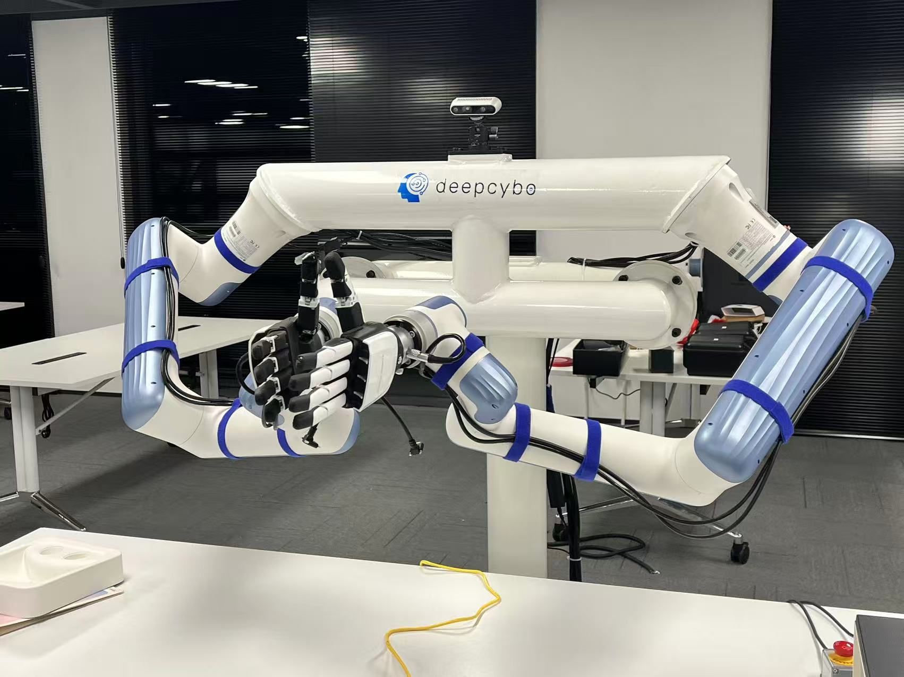

# Dobot Nova5 双臂遥操作数据采集与回放指南

## 简介
本项目已迁移用于 Dobot Nova5 双臂系统的遥操作数据采集与回放，嵌入在 LeRobot 框架中。

Dobot Nova5 双臂（每臂 6 自由度，共 12 自由度）支持基于 ROS 的本地控制节点（在机器人侧），以及通过 zerorpc 在记录端进行远程通信。本仓库提供：

- Oculus Quest 控制器为人机界面，实现末端位姿增量控制（左右手对应左右臂）。
- Robotiq 2F-85 夹爪驱动（通过串口或系统映射为 /dev 路径）。
- 支持多相机采集（左手腕、右手腕、头部共 3 个 Intel RealSense 相机）。
- 以 LeRobot 数据集格式记录并可选地推送到 Hugging Face。

<p align="center">
  
  <br>
</p>

### 遥操作支持

本项目使用 Oculus Quest 3/3s 设备进行双臂末端位姿控制。常用按键说明：

- **RG（右手握持键）**：按住启动对应手臂的运动
- **LG（左手握持键）**：按住启动对应手臂的运动
- **LTr / RTr（左右手扳机）**：控制对应臂的夹爪（按下关闭，松开打开）
- **A 按钮**：请求机器人复位

控制器的位姿会映射为末端执行器的增量位姿（位置 + 姿态），并通过 zerorpc 发送到机器人侧的控制服务。

## 0. 控制端与机器人端说明
本方案假定机器人控制在 Robot Controller 或 NUC/边缘计算机上运行 ROS 节点（或其他本地服务），而本地工作站运行本仓库的记录/teleop 客户端，通过 zerorpc 与机器人端通信。机器人端应提供一个简单的动作接口（例如接收笛卡尔增量位姿与夹爪开闭命令）。

如果您的 Dobot 控制软件位于远端机器，请确保远端启动对应的接口服务（例如通过 zerorpc 或自定义 ROS-to-zerorpc 适配层）。

## 1. 环境配置

### 1.1 创建并激活 conda 环境
```bash
conda create -n dual_arm_data python=3.10
conda activate dual_arm_data
```

### 1.2 安装 lerobot
```bash
# 安装指定版本 0.3.4
# git checkout da5d2f3e9187fa4690e6667fe8b294cae49016d6
git clone https://github.com/huggingface/lerobot.git
cd lerobot
git checkout da5d2f3e9187fa4690e6667fe8b294cae49016d6
pip install -e .
```

### 1.3 克隆并安装遥操作控制源码
```bash
mkdir dual_arm_data_collection && cd dual_arm_data_collection
git clone https://github.com/Shenzhaolong1330/lerobot_dual_arm_teleop.git
cd lerobot_dual_arm_teleop
pip install -e .
```


### 1.4 查看可运行的命令
运行以下命令以查看所有可用的脚本：
```bash
dobot-help
# ==================================================
#  Dobot Dual Arm Teleoperation Utilities - Command Reference
# ==================================================

# Core Commands:
#   dobot-record           Record teleoperation dataset
#   dobot-replay           Replay a recorded dataset
#   dobot-visualize        Visualize recorded dataset

# Utility Commands:
#   utils-joint-offsets   Compute joint offsets for teleoperation

# Tool Commands:
#   tools-check-dataset   Check local dataset information
#   tools-check-rs        Retrieve connected RealSense camera serial numbers

# Shell Tools:
#   map_gripper.sh        Map Gripper Serial Port
#   check_master_port.sh  Get the Master Arm's Persistent Serial Identifier

# Test Commands:
#   test-gripper-ctrl     Run gripper control command (operate the gripper)

# --------------------------------------------------
#  Tip: Use 'dobot-help' anytime to see this summary.
# ==================================================
```
## 2. 获取和配置必要参数

### 2.1 获取 RealSense 相机序列号
请确保每次仅连接一个相机:
```bash
tools-check-rs
```

### 2.2 固定夹爪串口映射
例如，将夹爪映射到 `/dev/dual_arm_left_gripper`, 执行此操作前，请确保仅连接一个夹爪的usb设备。
```bash
map_gripper.sh dual_arm_left_gripper
```
随后，将设定的映射值填入`cfg.yaml`中的`gripper_port`字段
### 2.3 获取主臂的固定串口标识符
执行此操作前，请确保仅连接一个主臂的usb设备。
```bash
check_master_port.sh
```
随后，将获取的串口标识符填入`cfg.yaml`中的`port`字段，并修改设备访问权限:
```bash
sudo chmod 666 <your_master_port>
```
### 2.4 获取主臂-从臂关节角的误差周期
> **⚠️ 注意：在记录数据前，务必完成此步骤以设置正确的误差周期。否则，从臂可能发生意外的动作。**

在执行此操作前，请先手动拖动主臂，使其关节角与从臂的当前关节角尽量保持一致。然后运行以下命令来计算主臂与从臂关节角的误差周期：
```bash
utils-joint-offsets
```
随后，请将脚本输出的`joint_offsets`值填入`cfg.yaml`中的对应配置项

### 2.5 Oculus Quest 设置（用于 Oculus 遥操作模式）

如果您计划使用 Oculus Quest 进行遥操作，请按照以下步骤设置设备：

#### 2.5.1 安装 ADB（Android 调试桥）

ADB 是 Oculus Quest 与计算机之间通信所必需的工具。

```bash
# 在 Ubuntu 上
sudo apt install android-tools-adb

# 验证安装
adb version
```

#### 2.5.2 在 Oculus Quest 上启用开发者模式

1. 在 [Meta for Developers](https://developer.oculus.com/manage/organizations/create/) 创建或加入开发者组织
2. 在手机上打开 Meta Quest 应用
3. 进入 **设置** → 选择您的设备 → **更多设置** → **开发者模式**
4. 启用 **开发者模式** 开关

#### 2.5.3 连接 Oculus Quest 到计算机

**方式 A：USB 连接（推荐用于初始设置）**

1. 使用 USB-C 线缆将 Oculus Quest 连接到计算机
2. 佩戴头显并在提示时允许 USB 调试
3. 勾选 **始终允许来自此计算机**
4. 验证连接：
```bash
adb devices
# 预期输出：
# List of devices attached
# <device_id>    device
```

**方式 B：无线连接（操作更便捷）**

1. 首先通过 USB 线缆连接
2. 确保 Oculus Quest 和计算机连接到同一网络
3. 获取 Oculus Quest 的 IP 地址：
```bash
adb shell ip route
# 查找 "src" 后面的 IP 地址，例如 192.168.110.62
```
4. 在 `record_cfg.yaml` 中配置 IP：
```yaml
teleop:
  oculus_config:
    ip: "192.168.110.62"  # 您的 Oculus Quest IP 地址
```

#### 2.5.4 安装 Oculus Reader APK

Oculus Reader APK 已随本项目预打包。安装方法：

```bash
# 进入 APK 目录
cd lerobot_teleoperator/lerobot_teleoperator/oculus/oculus_reader/APK

# 将 APK 安装到 Oculus Quest
adb install -r teleop-debug.apk
```

安装完成后，应用将出现在您的 Oculus Quest 库中的 **未知来源** 下。

#### 2.5.5 在 record_cfg.yaml 中配置 Oculus 遥操作

```yaml
record:
  control_mode: "oculus"  # 设置控制模式为 oculus
  
  teleop:
    control_mode: "oculus"
    oculus_config:
      ip: "192.168.110.62"  # Oculus Quest IP 地址
      use_gripper: True
      pose_scaler: [2.0, 1.5]  # [位置缩放, 姿态缩放]
      channel_signs: [1, 1, 1, -1, -1, 1]  # 各轴方向符号 [x, y, z, rx, ry, rz]
```

#### 2.5.6 Oculus 控制器操作说明

| 控制键 | 功能 |
|--------|------|
| **RG（右手握持键）** | 按住以启动机器人运动 |
| **RTr（右手扳机）** | 按下关闭夹爪，松开打开夹爪 |
| **A 按钮** | 请求机器人复位 |
| **右手控制器位姿** | 控制末端执行器增量位姿 |

#### 2.5.7 坐标系映射

Oculus 坐标系映射到机器人坐标系如下：

| Oculus 轴 | 机器人轴 | 描述 |
|-----------|----------|------|
| X（右） | -Y（左） | 横向移动 |
| Y（上） | Z（上） | 垂直移动 |
| Z（向后） | X（前） | 前后移动 |

#### 2.5.8 测试 Oculus 连接

在录制之前，测试 Oculus 连接：

```python
from lerobot_teleoperator.lerobot_teleoperator.oculus.oculus_robot import OculusRobot

oculus = OculusRobot(ip='192.168.110.62')
while True:
    action = oculus.get_action()
    print(f"增量位姿: {action[:6]}, 夹爪: {action[6]}")
```

#### 2.5.9 故障排除

**连接问题：**
```bash
# 重启 ADB 服务器
adb kill-server
adb start-server

# 检查已连接设备
adb devices
```

**停止 Oculus 应用：**
```bash
adb shell am force-stop com.rail.oculus.teleop
```

**重新安装 APK：**
```bash
adb uninstall com.rail.oculus.teleop
adb install -r teleop-debug.apk
```

## 3. 数据集记录

### 3.1 上传数据到 Hugging Face（可选）
1. 在 `cfg.yaml` 中设置：
```yaml
push_to_hub: True
```
2. 获取 Hugging Face 账号的 token 并登录：
```bash
huggingface-cli login --token ${HUGGINGFACE_TOKEN} 
huggingface-cli whoami  # 检查是否登录成功
```

### 3.2 开始记录
1. 打开机器人的使能。
2. 确认 `cfg.yaml` 中参数配置正确。
3. 为了确保数据收集过程规范，请先阅读 `9. 数据集命名与记录详解` 以了解数据记录细节，然后再运行以下命令：
```bash
dobot-record
```
<p align="center">
  
  <br>
  <b>Figure 1: Record</b>
</p>

## 4. 数据集回放
```bash
dobot-replay #注意cfg配置
```

## 5. 数据集可视化
```bash
dobot-visualize #注意cfg配置
```
<p align="center">
  
  <br>
  <b>Figure 2: Visualization</b>
</p>

## 6. 数据集追加与恢复
如果你已经在指定的 `repo_id` 下录制过数据集，可以在 `cfg.yaml` 中将 `resume` 设置为 `True`，并在 `resume_dataset` 中填写要追加的数据集名称，以便在现有数据集的基础上继续录制。然后运行以下命令：
```bash
dobot-record
```

## 7. 数据集合并
如果你在不同阶段分别录制了数据集，请确保各阶段的数据集具有不同的 `repo_id`, 完成录制后，可通过以下命令将它们合并为一个数据集: 
```bash
lerobot-edit-dataset 
    --repo_id <merged_repo_id> 
    --operation.type merge 
    --operation.repo_ids "['<repo_id_1>', '<repo_id2>']"
```
- 更多数据集处理命令，请参考 [LeRobot](https://huggingface.co/docs/lerobot/using_dataset_tools)

## 8. 录制控制按键说明
1. **右方向键**  
   1. 按下右方向键: 结束当前 episode 的录制并保存数据，程序将暂停等待。
   2. 进入**复位**阶段: 按回车键以继续（此时从臂会直接跟随主臂运动），请通过主臂将从臂复位至初始位姿。
   3. 再次按下右方向键，开始录制下一个episode
2. **左方向键**  
   - 按下后：重新开始当前 episode 的录制

3. **Esc 键**  
   - 按下后：退出整个录制任务，并保存当前已录制的数据

4. **Ctrl+c或抛出异常**
   - 按下或发生异常时：自动进入异常处理阶段，提示用户是否删除当前未完成的录制数据
  
## 9. 数据集命名与记录详解
### 1. 数据集命名
<p align="center">
  
  <br>
  <b>Figure 3: Dataset</b>
</p>

<p align="center">
  
  <br>
  <b>Figure 4: Dataset Info</b>
</p>

1. 数据集默认保存在 `~/.cache/huggingface/lerobot` 目录下，包含三类内容：

   - `dataset_info.txt`：自动记录本地数据集信息，包括以下字段：`record_id`、`name`、`task`、`date`、`version`、`user_info` 和 `type`。其中，`user_info` 可以通过 `cfg.yaml` 中的 `user_notes` 进行注解。

   - `dataset_info_backup`：当通过 `tools-check-dataset` 手动更新 `dataset_info.txt` 时，保存旧的记录备份。

   - 数据集文件夹：存放实际的数据集内容。

  
2. 数据集命名格式为 `[description]_[date]_[version]`。其中：
   - `description` 来源于 `cfg.yaml` 中的 `repo_id=<user_name>/<description>`；
   - `date` 会自动生成；
   - `version` 会根据是否存在同名数据集( `repo_id` 相同)自动生成新版本号。
3. description 命名规则：`task.description -> Verb_SourceObject_prep_TargetObject`。  
   即将 `cfg.yaml` 中的 `task.description` 按照上述格式映射生成。例如：  
   `Pick up the green cube and put it into the trash bin -> pick_greencube_into_trashbin`。

### 2. 数据记录说明
1. 完成步骤 `2. 获取和配置必要参数`。
2. 根据任务内容，在 `cfg.yaml` 的 `task.description` 中填写指令，并根据数据集命名规则设置 `repo_id`。
3. 检查并调整 `cfg.yaml` 中的其他参数，确保配置正确。
4. 运行命令 `dobot-record`，为确保安全， 请保证主臂与从臂关节角近似，`dobot-record` 会自动执行 `2.4 获取主臂-从臂关节角误差周期` 检查，然后按照 `8. 录制控制按键说明` 完成录制操作。
5. 数据记录结束后，数据集同级目录会生成 `dataset_info.txt` 文件，用于保存本地数据集信息。如果手动删除过数据集，可通过以下命令更新记录信息：
```bash
tools-check-dataset